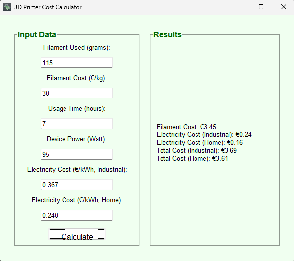
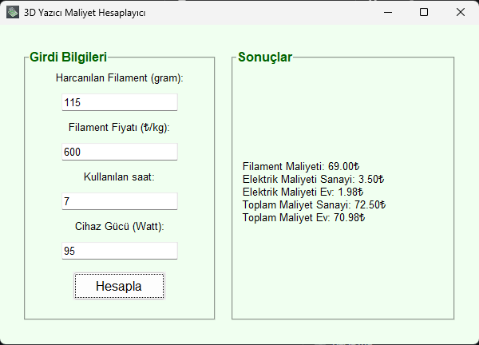

# 3D Printer Cost Calculator | 3D Yazıcı Maliyet Hesaplayıcı

## English

This Python application is designed to calculate the cost of using a 3D printer. It provides a user-friendly interface to calculate filament cost and electricity consumption.

### Features
- **Filament cost calculation** (cost per gram)
- **Electricity cost calculation** (separate calculations for industrial and home use)
- **Total cost calculation**
- **Tkinter-based graphical interface**
- **Easy to use**

### Requirements
Python must be installed to run this application. The following libraries are required:

```bash
pip install tkinter
```

### Usage
1. **To run the application:**
   ```bash
   python CostCalculator.py
   ```
2. **Enter the required details:**
   - Consumed filament (grams)
   - Filament cost (per kg)
   - Usage duration (hours)
   - Device power (Watts)
   - Electricity Prices
3. **Click the calculate button and view the results!**

### EXE File
For users without Python installed, you can download the compiled EXE version here:
[Download](https://github.com/potovzuc/3D-Printer-Cost-Calculator/raw/refs/heads/main/Cost%20Calculator.exe)

### Screenshot



### Support Me
If you liked this project, you can buy me a coffee:
ETH: 0xfd74638d98fdda416c2d84c0a1714a7684d11213


---

## Türkçe

Bu Python uygulaması, 3D yazıcı kullanımının maliyetini hesaplamak için tasarlanmıştır. Kullanıcı dostu bir arayüz sunarak filament maliyeti ve elektrik tüketimini hesaplar.

### Özellikler
- **Filament maliyet hesaplama** (gram başına maliyet)
- **Elektrik maliyeti hesaplama** (sanayi ve ev için ayrı hesaplama)
- **Toplam maliyet hesaplama**
- **Tkinter tabanlı grafik arayüz**
- **Kolay kullanım**

### Gereksinimler
Bu uygulamayı çalıştırmak için Python yüklenmiş olmalıdır. Aşağıdaki kütüphaneler gereklidir:

```bash
pip install tkinter
```

### Kullanım
1. **Uygulamayı çalıştırmak için:**
   ```bash
   python MaliyetHesaplayıcı.py
   ```
2. **Gerekli bilgileri girin:**
   - Harcanan filament (gram)
   - Filament maliyeti (kg başına)
   - Kullanım süresi (saat)
   - Cihaz gücü (Watt)
3. **Hesapla tuşuna basın ve sonuçları görün!**

### EXE Dosyası
Python kurulu olmayan kullanıcılar için uygulamanın derlenmiş EXE sürümünü buradan indirebilirsiniz:
[İndir](https://github.com/potovzuc/3D-Printer-Cost-Calculator/raw/refs/heads/main/Maliyet%20Hesaplay%C4%B1c%C4%B1.exe)

### Ekran Görüntüsü



### Bağış Yap
Bu projeyi beğendiyseniz bana bir kahve ısmarlayabilirsiniz:
ETH: 0xfd74638d98fdda416c2d84c0a1714a7684d11213


